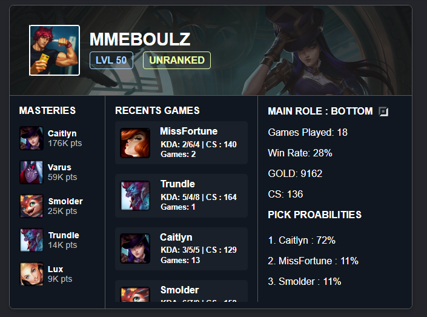

# 🕵️‍♂️ LOLWATCHER

**LOLWATCHER** est un dashboard minimaliste dédié à l'analyse de vos performances sur League of Legends. Il permet de suivre un groupe de joueurs et de visualiser leurs statistiques clés en un coup d'œil.

*A minimalist dashboard dedicated to analyzing your League of Legends performance. It allows you to track a group of players and visualize their key statistics at a glance.*



---

## ✨ Fonctionnalités / Features

* **Multi-Joueurs Illimité :** Ajoutez autant de joueurs que vous le souhaitez via un fichier de configuration simple.
    * *Unlimited Multi-Player: Add as many players as you want via a simple configuration file.*
* **Focus Europe :** Le script est configuré pour récupérer les données des serveurs Europe (EUW/EUNE).
    * *Europe Focus: The script is configured to fetch data from Europe servers (EUW/EUNE).*
* **Stats Complètes :** Affiche le rang, le niveau, les points de maîtrise des champions et le winrate par rôle.
    * *Complete Stats: Displays rank, level, champion mastery points, and winrate by role.*

---

## 📋 Prérequis & API / Prerequisites & API

Pour utiliser ce projet, vous avez besoin de Python et d'une clé API Riot Games valide.
*To use this project, you need Python and a valid Riot Games API key.*

### 🔑 Configuration de la Clé API / API Key Setup

1.  Obtenez votre clé de développement sur le [Riot Developer Portal](https://developer.riotgames.com/).
    *Get your development key from the [Riot Developer Portal](https://developer.riotgames.com/).*

2.  **IMPORTANT :** Vous devez définir votre clé dans une variable d'environnement nommée `RIOT_API_KEY`.
    *IMPORTANT: You must set your key in an environment variable named `RIOT_API_KEY`.*

    Le script vérifie la présence de cette variable pour fonctionner :
    *The script checks for this variable to run:*

    ```python
    API_KEY = os.getenv("RIOT_API_KEY")
    if not API_KEY:
        raise SystemExit("Please set RIOT_API_KEY environment variable")
    ```

---

## 🛠️ Installation

1.  **Cloner le dépôt / Clone the repository :**
    ```bash
    git clone [https://github.com/Ako-Didion/LOLWATCHER.git](https://github.com/Ako-Didion/LOLWATCHER.git)
    cd LOLWATCHER
    ```

2.  **Installer les dépendances / Install dependencies :**
    ```bash
    pip install -r requirements.txt
    ```

---

## ⚙️ Configuration des Joueurs / Player Configuration

Vous pouvez gérer la liste des joueurs suivis en modifiant le fichier `player.txt`.
*You can manage the list of tracked players by editing the `player.txt` file.*

1.  Ouvrez le fichier `player.txt` à la racine du projet.
    *Open the `player.txt` file at the root of the project.*
2.  Ajoutez les joueurs en renseignant leur **Riot ID** et leur **Tagline** (ex: `MMEBOULZ#EUW`).
    *Add players by entering their **Riot ID** and **Tagline** (e.g., `Name#EUW`).*
3.  **Note :** Assurez-vous que les joueurs sont bien sur le serveur **Europe**.
    *Note: Ensure the players are on the **Europe** server.*

---

## 🚀 Utilisation / Usage

1.  **Lancer le script de récupération / Run the fetch script :**
    Cela va mettre à jour le fichier `stats_groupe.json` avec les dernières données.
    *This will update the `stats_groupe.json` file with the latest data.*

    ```bash
    python main.py
    ```

2.  **Visualiser le Dashboard / View the Dashboard :**
    Ouvrez simplement le fichier `index.html` dans votre navigateur web.
    *Simply open the `index.html` file in your web browser.*

---

## 🏗️ Technologies

* **Python :** Backend & Riot API Requests
* **HTML5 / CSS3 / JavaScript :** Frontend Dashboard
* **JSON :** Data Storage

---

**Développé avec ❤️ par / Developed with ❤️ by [Ako-Didion](https://github.com/Ako-Didion)**
